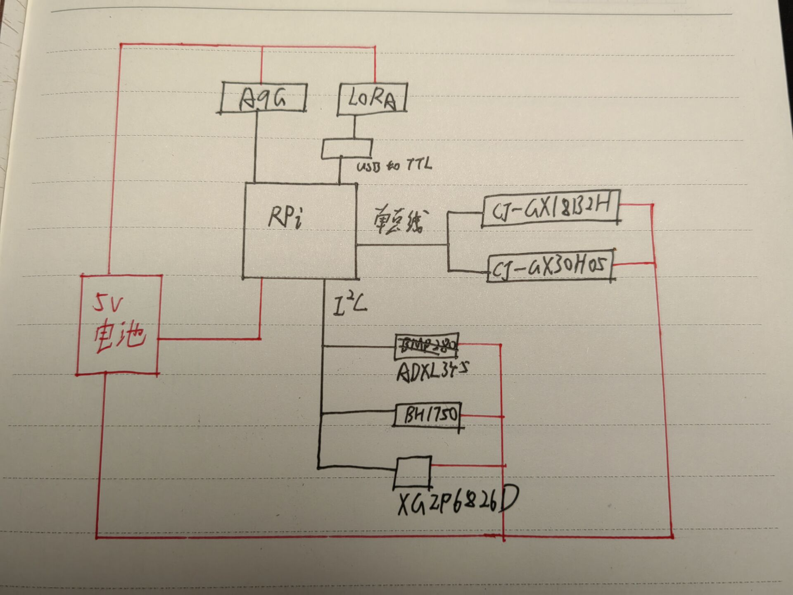

# 青鸟2022高海拔气球

青鸟2022是由一名准大一学生发起的高海拔气球项目，该项目目标为：在2个月内释放并试图回收一个高海拔氦气球，记录气球上升阶段的位置、海拔、大气压强、温度等数据，拍摄高海拔影像。

此文档为设计过程中气球的初步设想，随着项目的进行会有多次修改，目前为第4版。

* [气球构成](#气球构成)
* [有效载荷](#有效载荷)
    * [载荷设计](#载荷设计)
    * [计算](#计算)
    * [通信](#通信)
    * [传感器](#传感器)
    * [PCB](#pcb)
    * [电池](#电池)

## 气球构成
整个气球分为三个部分：气球球体、有效载荷、降落伞。
## 有效载荷
### 载荷设计
载荷以一块矩形碳纤维板为主体，电池、PCB直接与其接触并固定。树莓派的下方与电池接触，起到加热电池的作用。

电池的两侧分别留出两个长条状的洞，用于粘贴铝箔胶带同时固定电池。

树莓派针脚一侧通过长螺丝固定在碳纤维板上，底面使用导热双面胶粘贴在电池上。

为了便于固定PCB同时减轻质量，碳纤维板在固定了PCB的部位会留有矩形空洞。

碳纤维板的向地面安装环境温度传感器(防止阳光影响传感数值)、GSM、LoRa天线，背地面固定PCB和GPS天线。

为保持电子元件的温度，用铝箔胶带包裹电池并延伸至PCB(同时做好绝缘)，电子元件外层再包裹镀铝聚酰亚胺膜(天线放置于薄膜外)。

在碳纤维的四个角处留出四个圆形孔洞，用于连接气球和降落伞。

### 计算
载荷搭载一块树莓派Zero2W，硬件串口连接安信可A9G，USB接口连接一个USB转TTL来充当第二个串口连接A39C。
### 通信
载荷共有三种通信装置，分别为A9G Pudding(GPRS)、A39C-T400A30S1a(433MHz LoRa)、无线定位终端。

* GPRS：在气球放飞前或落回底面信号覆盖区后通过GSM网络回传位置信息以及传感数据。

* A39C：为了减轻质量并未使用6dBi的增益天线，而是使用3dBi的贴片软天线，通信距离可能会受到影响。该模块作用为在气球上升至一定高度后回传位置、高度信息以及部分传感数据。

* 无线定位终端不与树莓派连接，仅仅作为备用定位设备以防GPRS模块失效。
### 传感器
载荷携带的传感器有：XGZP6826D、CJ-GX18B20H、CJ-GX30H05、ADXL345、BH1750。

分别为压强传感器、两个温度传感器、加速度模块、光强度模块，通过IIC或单总线与树莓派连接。
### PCB
双层PCB，各个模块均焊接其上(有一些非贴片的模块也强行焊接上，同时使用双面胶粘贴)

在A9G的下方留个洞，便于安装SIM卡。
### 电池
中顺芯1800mAh -40°低温电池。